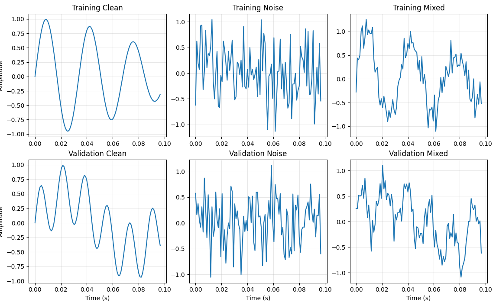
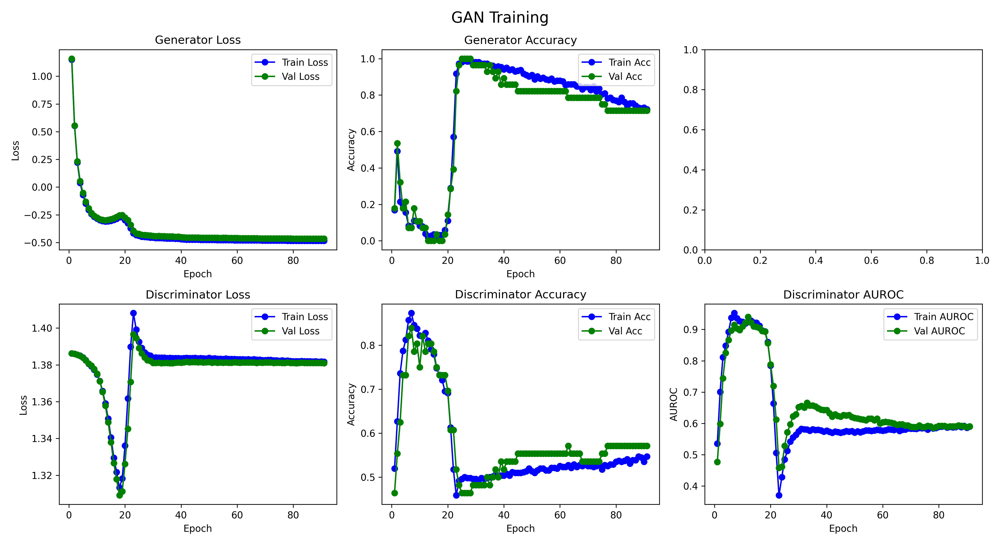
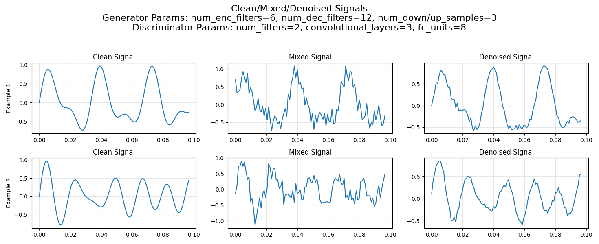

# Denoising Adversarial Network (DAN)

Denoising Autoencoder trained on a generative adversarial network (GAN). Autoencoder for use in denoising
audio signals.

## Current State

Capable of being trained on denoising sinusoidal composition signals corrupted with Gaussian White Noise (GWN)

These are notable constraints, and even with these, the training process is computationally expensive when training on a standard laptop. 

Can assumably be extended to train on sample rates of up to 44100Hz when given proper computational power.

## Setup

Install dependencies in requirements.txt

Setup a data folder as follows:
```
GAN-Denoiser
├── data
│   ├── resampled
│   ├── train
│   │   ├── clean
│   │   ├── mixed
│   │   └── noise
│   └── validation
│       ├── clean
│       ├── mixed
│       └── noise
└── ...
```
This is where created noise, sine, and mixed (noise + sine) signals will be stored.

Run create_data.py
This should result in folders being filled with data, and displaying plots for a random signal from each folder.
Signals should be displayed as follows (different of course, since they are randomly generated)


Then run dataset.py to verify that everything is working properly (this won't actually do anything to memory)

Now we can run train_gan.py

Fine-tune hyperparameters (generator architecture, discriminator architecture, data creation parameters, training parameters) as desired.

## Example

Training on the same dataset from the created data example above, we see the following performance and generator results:



## Architecture

Consists of 2 models:
- Generator (aka Denoising Autoencoder)
- Discriminator

### Generator

The Generator is an autoencoder based strongly off of [this article](https://www.mathworks.com/help/signal/ug/denoise-signals-with-generative-adversarial-networks.html) by Mathworks. It is tasked with taking as input a noisy signal and outputting a denoised version of that signal.

### Discriminator

The Discriminator is tasked with distinguishing clean signals apart from faux clean signals (denoised signals produced by the generator). 

### Training

The Discriminator is trained in classic GAN fashion, using the BCE loss between clean signals and denoised signals.

The Generator, however, is trained on a hybrid loss function. It uses adversarial loss, just as so in a standard GAN, but also reconstruction loss. The adversarial loss is just BCE loss upon how well it "fools" the discriminator. The reconstruction loss is the L1 Norm between the clean signal and the generated denoised signal. 

## Ideas

Given this is a trivial dataset, generated through random uniform and gaussian distributions, this model will by no means be efficient on real-world data alone. 

However, it may serve as a good initialization in more complex models, e.g. for use in denoising bird calls in nature settings where noise is highly abundant. Given we have full control at curating our dataset, and essentially being able to create as much data as we need, we can fine-tune dataset creation parameters like min/max frequency (to match frequnecy range of bird vocalizations), and noise distributions (to match noise found in rainforests (rain, wind, etc)).

Furthermore, there's been notable advancements in denoising methods using similar architectural methods, such as deep feature loss as utilized by [Zhang et al. 2024](https://www.sciencedirect.com/science/article/pii/S1574954124000591). 