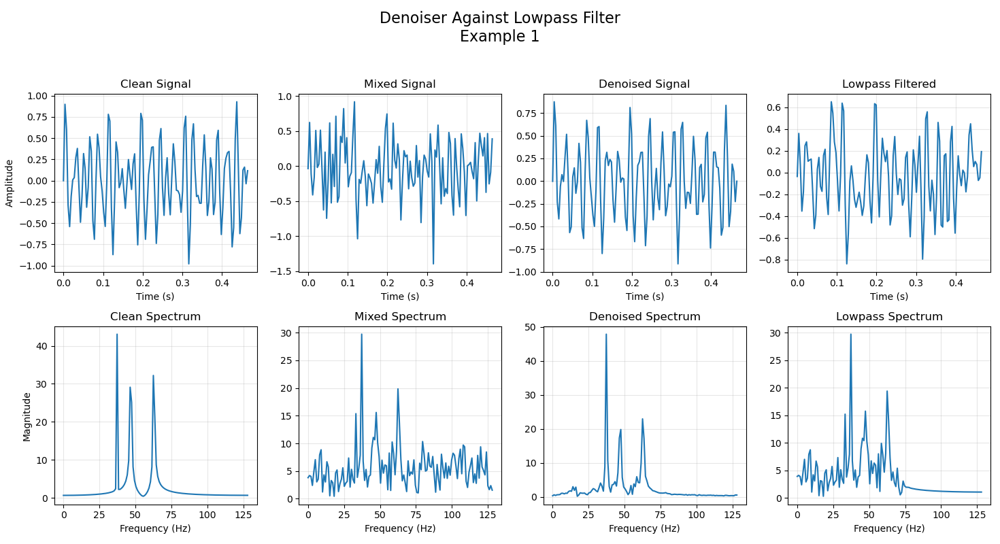
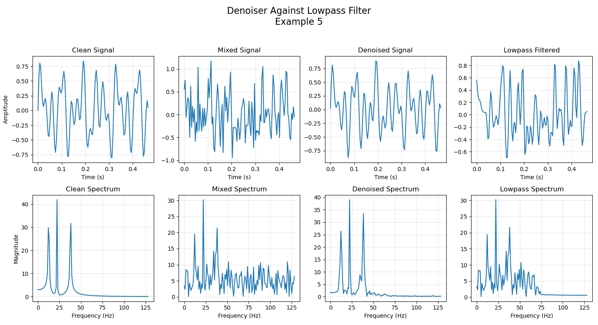
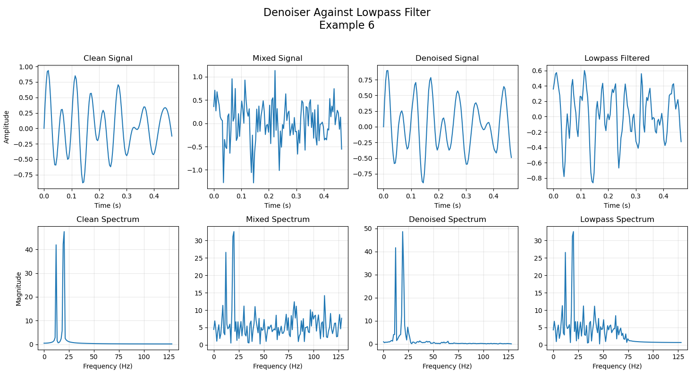
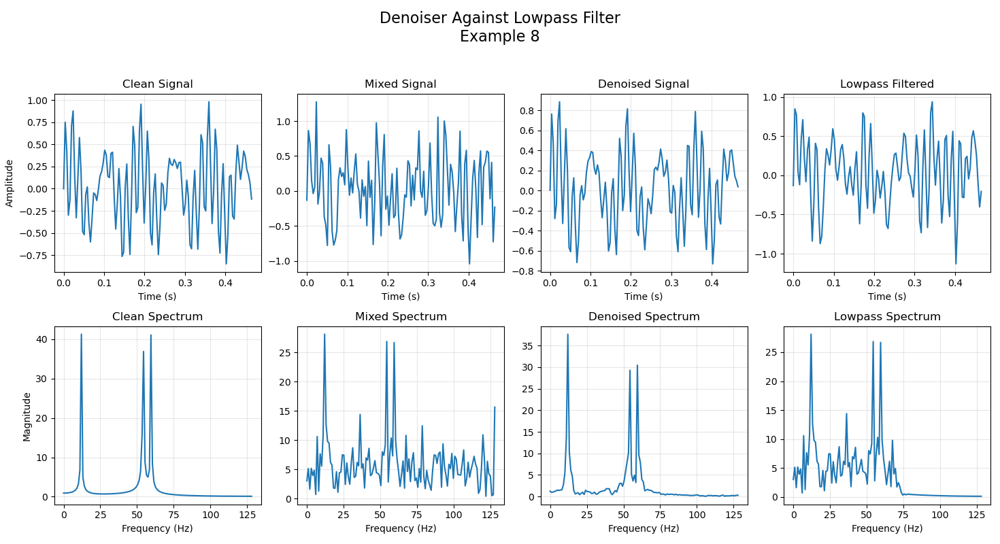

# Lightweight Denoising Adversarial Network (DAN)

A novel implementation of a denoising autoencoder trained within a generative adversarial network (GAN) framework, specifically designed for audio signal denoising tasks.

## Overview

This repository presents an ultra-lightweight hybrid denoising architecture combining autoencoder and GAN methodologies. The implementation features a generator serving as a primary denoising component, with highly efficient parameter utilization: 282,177 parameters for the generator and 10,577 parameters for the discriminator. This efficient design enables training on standard consumer hardware without requiring specialized GPU capabilities.

Due to computational constraints, the current implementation is optimized for signals sampled at 256 samples/second, processing 1-second duration signals composed of three randomly generated sine waves within the 10Hz - 64Hz frequency range. The model addresses Gaussian white noise contamination within the 0Hz - 128Hz range.

Comparative analysis against traditional lowpass filtering demonstrates complementary strengths: while lowpass filters excel at high-frequency noise elimination, they exhibit limitations within the generated-sine-range. Conversely, our lightweight denoiser shows superior performance in reducing noise within the signal frequency range, albeit with some limitations in complete high-frequency noise elimination.

### Data Generation Methodology

The training data consists of:

1. Clean Signals:
   - Three-component sinusoidal compositions
   - Frequency range: 10Hz - 64Hz (uniform random distribution)
   - Design ensures minimal training-validation set overlap

2. Noise Generation:
   - Gaussian white noise (GWN)
   - Parameters: μ = 0, σ = 0.5
   - 256 samples per signal

3. Signal Combination:
   - Mixed signals generated at SNR = -2
   - Paired clean-mixed signal combinations for reconstruction loss computation

4. Dataset Distribution:
   - Total samples: 1800
   - Training set: 1600 samples
   - Validation set: 200 samples

Sample visualization of generated data across different sets:


### Network Architecture

#### Generator
The generator implements an autoencoder architecture adapted from established signal processing methodologies, optimized for the denoising task.


#### Discriminator
The discriminator employs a compact architecture designed to differentiate between clean signals and generator outputs effectively.


### Training Methodology

The training protocol implements a hybrid approach:

1. Discriminator Training:
   - Standard GAN methodology
   - BCE loss between clean and denoised signals

2. Generator Training:
   - Hybrid loss function combining:
     - Adversarial loss (BCE-based discriminator deception metric)
     - Reconstruction loss (L1 norm between clean and generated signals)

Training visualization:


### Performance Analysis

Training parameters:
- Initial generator training: 40 epochs
- Combined training: Maximum 200 epochs
- Early stopping patience: 50 epochs
- Convergence achieved: Epoch 107

Validation set performance examples:


Representative output comparisons (clean, mixed, denoised, and low-pass filtered signals):









Performance observations:
1. Optimal Performance (Examples 4, 5, 8):
   - Near-perfect signal reconstruction
   - Minimal residual noise
   - Preserved component magnitudes

2. Moderate Success (Examples 1, 3, 6, 7):
   - Component magnitude variations
   - Residual frequency artifacts

3. Suboptimal Cases (Example 2):
   - Signal collapse to single-frequency component

## Implementation Guide

The implementation is optimized for standard laptop configurations, with typical training duration of 10-15 minutes for 300 epochs using current architectures.

### Setup Requirements

1. Directory structure:
```
GAN-Denoiser
├── data
│   ├── resampled
│   ├── train
│   │   ├── clean
│   │   ├── mixed
│   │   └── noise
│   └── validation
│       ├── clean
│       ├── mixed
│       └── noise
└── ...
```

2. Installation:
   - Install dependencies from requirements.txt

### Execution Steps

1. Data Generation:
   - Execute create_data.py
   - Verify data generation through displayed random signal plots

2. Dataset Validation:
   - Run dataset.py for system compatibility verification

3. Model Training:
   - Execute train_gan.py
   - Adjust hyperparameters as needed:
     - Generator architecture
     - Discriminator architecture
     - Data creation parameters
     - Training parameters

## Academic References

1. MathWorks. "Denoise Signals with Generative Adversarial Networks." Signal Processing Toolbox Documentation. This implementation draws significant inspiration from their architectural and training methodologies.

2. Zhang et al. (2024). "Deep Feature Loss for Signal Denoising." Advanced Engineering Informatics. This work influenced our approach to CNN-based denoising strategies.