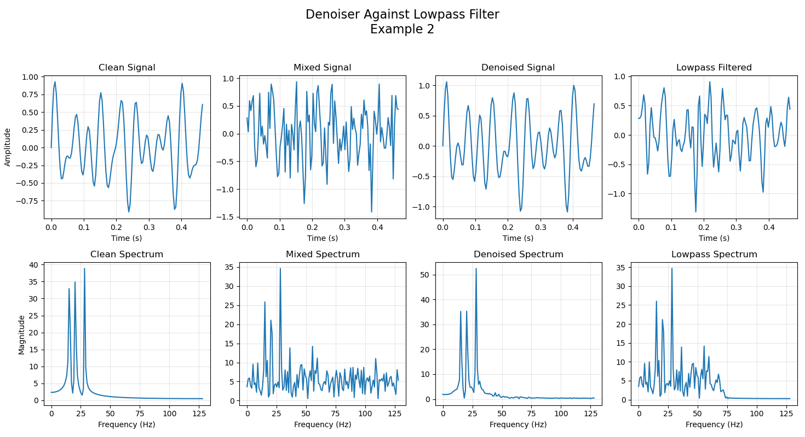

# Denoising Adversarial Network (DAN)

Denoising Autoencoder trained on a generative adversarial network (GAN). Autoencoder for use in denoising
audio signals.

## Overview

An extremely lightweight hybrid denoising AE/GAN. The generator acts as the denoiser. It is currently set up to only 26373 generator parameters and 1245 discriminator parameters. This makes it feasible to train on a standard laptop (no need for external GPUs needed!). However, due to how weak it is, it is currently setup to only be capable of removing noise from signals sampled at 256 samples/second. In particular, the signals are only 1 second in length, thus 256 samples long, and are composed of 3 sine waves generated uniformly at random with a range of [10Hz - 64Hz]. The gaussian white noise is thus in the range (0Hz - 128Hz]. 

Trained denoiser outputs are compared against a lowpass filter. As we'll see, the lowpass filter excels in removing high frequencies, but fails to eliminate noise within the generated-sine-range. The lightweight denoiser fails to remove high frequencies completely, but can significantly reduce frequencies within the generated-sine-range.

### Data Creation

The sinusoidal compositions (clean signals) are generated uniformly at random with a range of [10Hz - 64Hz]. This composition of 3 components significantly reduces the likeliehood of training data showing up in the validation set.

The noise is gaussian white noise (GWN), sampling each of the 256 samples (which serve as the amplitude of the signal) within each generated signal from a normal distribution, with a mean of 0 and standard deviation of 0.5. 

The clean and noise signals are then mixed into "mixed" signals, with signal-to-noise ratio (SNR) of -2. To later perform reconstruction loss, we combine the i-th generated clean signal with the i-th generated mixed signal, for all generated signals. 

A total of 1800 samples are generated, and split into train and validation sets with a ratio of 1600:200 respectively. The following image shows each type of signal from each split:


### Generator

The Generator is an autoencoder based strongly off of [this article by Mathworks](https://www.mathworks.com/help/signal/ug/denoise-signals-with-generative-adversarial-networks.html). It is tasked with taking as input a noisy signal and outputting a denoised version of that signal.


### Discriminator

The Discriminator is tasked with distinguishing clean signals apart from faux clean signals (denoised signals produced by the generator). 


### Training

The Discriminator is trained in classic GAN fashion, using the BCE loss between clean signals and denoised signals.

The Generator, however, is trained on a hybrid loss function. It uses adversarial loss, just as so in a standard GAN, but also reconstruction loss. The adversarial loss is just BCE loss upon how well it "fools" the discriminator. The reconstruction loss is the L1 Norm between the clean signal and the generated denoised signal. [Here is another Mathworks article](https://www.mathworks.com/help/signal/ug/signal-denoising-using-adversarial-learning-denoiser-model.html#DenoiseSignalsWithAdversarialDenoiserModelExample-1) which strongly incorporates this logic.


Training on the same dataset from the created data example above, we see the following performance and generator results:




## Setup

The training can be done on a standard laptop, and takes around 10-15 minutes for 300 epochs (with the current model architectures).

Install dependencies in requirements.txt

Setup a data folder as follows:
```
GAN-Denoiser
├── data
│   ├── resampled
│   ├── train
│   │   ├── clean
│   │   ├── mixed
│   │   └── noise
│   └── validation
│       ├── clean
│       ├── mixed
│       └── noise
└── ...
```
This is where created noise, sine, and mixed (noise + sine) signals will be stored.

Run create_data.py
This should result in folders being filled with data, and displaying plots for a random signal from each folder

Then run dataset.py to verify that everything is working properly (this won't actually do anything to memory)

Now we can run train_gan.py

Fine-tune hyperparameters (generator architecture, discriminator architecture, data creation parameters, training parameters) as desired.

## Citations

As aforementioned, a lot of the confidence in building this model, and the layout of the models and training process itself, is all strongly inspired by [this article](https://www.mathworks.com/help/signal/ug/denoise-signals-with-generative-adversarial-networks.html) by Mathworks. In essence, we try to attempt 

There's been notable advancements in denoising methods using similar architectural methods, such as deep feature loss as utilized by [Zhang et al. 2024](https://www.sciencedirect.com/science/article/pii/S1574954124000591). This repo was inherently inspired by this paper, as an attempt to build a foundational understanding of such CNN denoisers.

